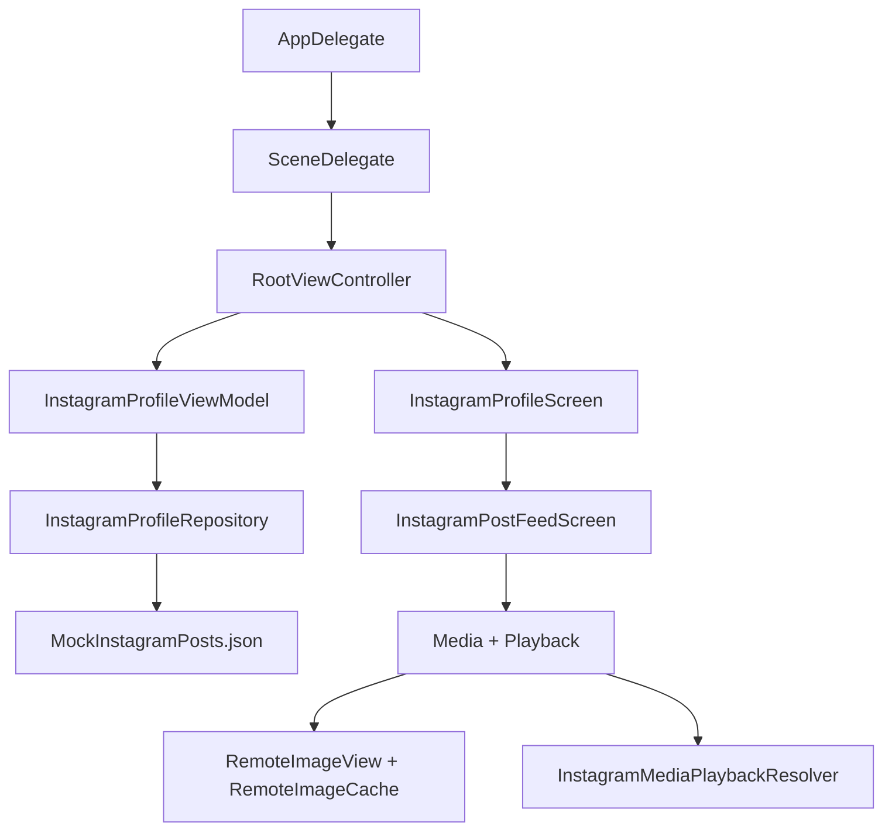

# Architecture

This file is the living architecture reference for `insta-reels`.

Use it to:
- understand how the app is put together
- decide where new code should live
- keep feature work aligned with the existing structure
- update future contributors on transition, media, and data-flow decisions

Update this file whenever any of these change:
- a new screen or major controller is added
- data starts coming from a new source
- transition behavior changes
- shared media/loading infrastructure changes
- folders gain a new responsibility

## Overview

`insta-reels` is a UIKit app with fully programmatic layout. It renders an Instagram-style profile screen and an immersive post feed using bundled mock data.

High-level flow:

## Project Map

### App shell
- `insta-reels/insta_reelsApp.swift`
  Defines the UIKit `AppDelegate`.
- `insta-reels/SceneDelegate.swift`
  Creates the main window and installs the root controller.
- `insta-reels/RootViewController.swift`
  Owns the root `InstagramProfileViewModel`, hosts `InstagramProfileScreen`, and manages the post-launch overlay animation.

### Presentation layer
- `insta-reels/Views/InstagramProfileScreen.swift`
  UIKit profile screen controller, profile grid, feed overlay coordination, live open transition, snapshot-based close transition, and return-to-grid behavior.
- `insta-reels/Views/InstagramPostFeedScreen.swift`
  UIKit feed controller, fixed `Posts` top bar, feed scrolling, visible-post tracking, visible-media tracking, media paging, and inline video playback.

### Shared UI/media helpers
- `insta-reels/Views/CachedAsyncImage.swift`
  Shared `RemoteImageView` and cache infrastructure used by profile and feed surfaces.
- `insta-reels/Views/AppTheme.swift`
  Shared UIKit color constants.
- `insta-reels/Views/UIKitHelpers.swift`
  Small UIKit layout helpers used across programmatic views.
- `insta-reels/Data/InstagramMediaPlaybackResolver.swift`
  Resolves playable video URLs and provides mock fallbacks for unsupported media hosts.

### State + transformation layer
- `insta-reels/ViewModels/InstagramProfileViewModel.swift`
  Converts repository payloads into screen-ready models for the profile screen.

### Data layer
- `insta-reels/Data/InstagramProfileRepository.swift`
  Loads mock data, filters posts, builds related-user lists, and returns payloads for the view model.
- `insta-reels/MockInstagramDataset.swift`
  Core model definitions and JSON decoding for bundled mock content.
- `insta-reels/MockInstagramPosts.json`
  Bundled source of truth for posts, users, media, comments, and metrics.

## Layer Responsibilities

### 1. App and startup

`AppDelegate` and `SceneDelegate` should stay thin.

`RootViewController` is responsible for:
- creating the root view model
- attaching the main profile controller
- holding launch-overlay state
- deciding when the UI is ready to transition from launch to app content

Keep app-wide boot logic here unless it becomes reusable enough to justify its own coordinator or bootstrap layer.

### 2. View model layer

`InstagramProfileViewModel` is the adapter between raw repository data and UI-ready structures.

It is responsible for:
- loading the profile payload
- transforming posts into stats, highlights, grid items, and feed items
- exposing a simple `loading / loaded / failed` UI state

It should not:
- own animation state
- know about view geometry or controller coordination
- fetch media directly

### 3. Data layer

`InstagramProfileRepository` is the boundary around data retrieval.

It is responsible for:
- reading bundled mock posts
- filtering authored vs all-post grids
- deriving related users
- returning a stable `InstagramProfilePayload`

If the project later moves to a network backend, this is the layer that should change first. The view model should continue talking to a repository protocol, not to networking code directly.

### 4. Screen/controller layer

`InstagramProfileScreen` is the most stateful controller in the app today.

It owns:
- profile screen composition
- grid layout
- grid item frame measurement
- feed presentation state
- single-hierarchy overlay positioning
- open and close transition coordination
- dismiss snapshot state
- return-to-grid polish animation

`InstagramPostFeedScreen` owns:
- feed layout and scrolling
- compact fixed `Posts` top bar and back button
- visible post detection
- visible media frame reporting
- media pager state per feed card
- inline video lifecycle
- chrome visibility separate from the moving media surface

## Runtime Data Flow

Normal profile load:

1. `SceneDelegate` creates `RootViewController`.
2. `RootViewController` creates `InstagramProfileViewModel`.
3. `RootViewController` mounts `InstagramProfileScreen`.
4. `InstagramProfileScreen` calls `loadIfNeeded()`.
5. `InstagramProfileViewModel` requests a payload from `InstagramProfileRepository`.
6. The repository decodes bundled JSON via `MockInstagramDataset`.
7. The view model transforms the payload into `InstagramProfileScreenModel`.
8. `InstagramProfileScreen` renders the model.

Feed open flow:

1. User taps a grid item.
2. `InstagramProfileScreen` resolves the tapped grid cell frame.
3. `InstagramPostFeedScreen` is attached as an overlay child controller in the same hierarchy.
4. The live feed surface animates from the tapped cell frame to the full-screen frame.
5. Feed chrome fades in after the live media surface settles.

Feed close flow:

1. `InstagramProfileScreen` freezes feed-driven transition updates.
2. The target grid cell frame is resolved, scrolling the profile if needed.
3. Close captures the currently visible feed media into a bitmap snapshot.
4. The live feed overlay is hidden and the snapshot animates back to the grid cell.
5. State is reset only after the snapshot animation finishes.

## Transition Architecture

This project keeps the same hybrid transition strategy as the SwiftUI version, but now in UIKit.

### Opening transition

Opening uses a live overlay motion.

Current open behavior:
- never navigate away from the profile screen
- keep the feed in the same controller hierarchy as the profile screen
- record the tapped grid cell frame in window coordinates
- animate the live overlay from the grid cell frame to the full-screen frame
- keep the media visible during motion while feed chrome fades in afterward

Important implementation detail:
- `InstagramProfileScreen` owns the overlay frame and presentation sequencing
- `InstagramPostFeedScreen` reports the visible post, visible media, and media frame back to the profile screen

### Closing transition

Closing still prefers a snapshot overlay path because it is more stable than relying on two live views during teardown.

Current close behavior:
- freeze feed-driven transition updates during dismiss
- capture the current visible feed media into a snapshot
- animate the snapshot to the grid target frame
- hide the live feed overlay while the snapshot is animating
- restore the real grid only after the animation completes

If future work touches dismiss behavior, preserve these invariants:
- never let the target post/media change mid-dismiss
- never reveal the destination too early
- clean up animation state in one atomic step
- prefer the snapshot path over a live-view teardown if the two approaches conflict

## Media Architecture

`RemoteImageView` and `RemoteImageCache` are the shared image surfaces for the app.

They provide:
- async loading
- in-memory caching
- disk caching
- decoded-image reuse for repeated profile/feed surfaces

`InstagramMediaPlaybackResolver` isolates playback URL rules, especially for mock video handling.

If media support grows, extend these helpers before duplicating custom image/video loading in individual screens.

## Key State Ownership

### Root state
- `RootViewController`
  launch overlay and root view-model lifetime

### Screen state
- `InstagramProfileScreen`
  transition sequencing, overlay transform state, grid hiding, dismiss snapshot state, and grid return animation state

### Feed state
- `InstagramPostFeedScreen`
  fixed top-row layout, visible post detection, feed scrolling, visible media frame reporting, and chrome visibility
- `FeedMediaPagerView`
  selected media page per post
- `FeedVideoPlaybackController`
  inline video readiness, mute state, and playback loop behavior

## Conventions For Future Work

### Put code here when...

- Add profile-level UI or transition state:
  `insta-reels/Views/InstagramProfileScreen.swift`
- Add feed behavior or per-post feed rendering:
  `insta-reels/Views/InstagramPostFeedScreen.swift`
- Add screen-facing derived state:
  `insta-reels/ViewModels/InstagramProfileViewModel.swift`
- Add data fetching or payload shaping:
  `insta-reels/Data/`
- Add shared image/video utilities:
  `insta-reels/Views/CachedAsyncImage.swift` or `insta-reels/Data/`

### Avoid

- putting repository logic inside UIKit controllers
- putting geometry or animation state inside the view model
- duplicating image loading logic in multiple view files
- mixing mock-data decoding with view composition code

## Suggested Next Refactors

These are not required now, but they are the cleanest pressure-release points if the app grows:

1. Extract transition state from `InstagramProfileScreen` into a dedicated coordinator.
2. Split reusable profile subviews into separate files once the profile screen becomes harder to scan.
3. Move feed card, media pager, and video playback pieces into dedicated files if feed complexity increases.
4. Add a `docs/` folder if architecture, animation, and product docs grow beyond a single file.

## Maintenance Checklist

When you change the project structure, update this file by checking:

- Is there a new top-level screen or controller?
- Did any file take on a new responsibility?
- Did data start coming from a new source?
- Did the transition system change?
- Did media loading or playback behavior move?
- Does the project map still match the repo?

If the answer is yes to any of these, update `ARCHITECTURE.md` in the same change set.
