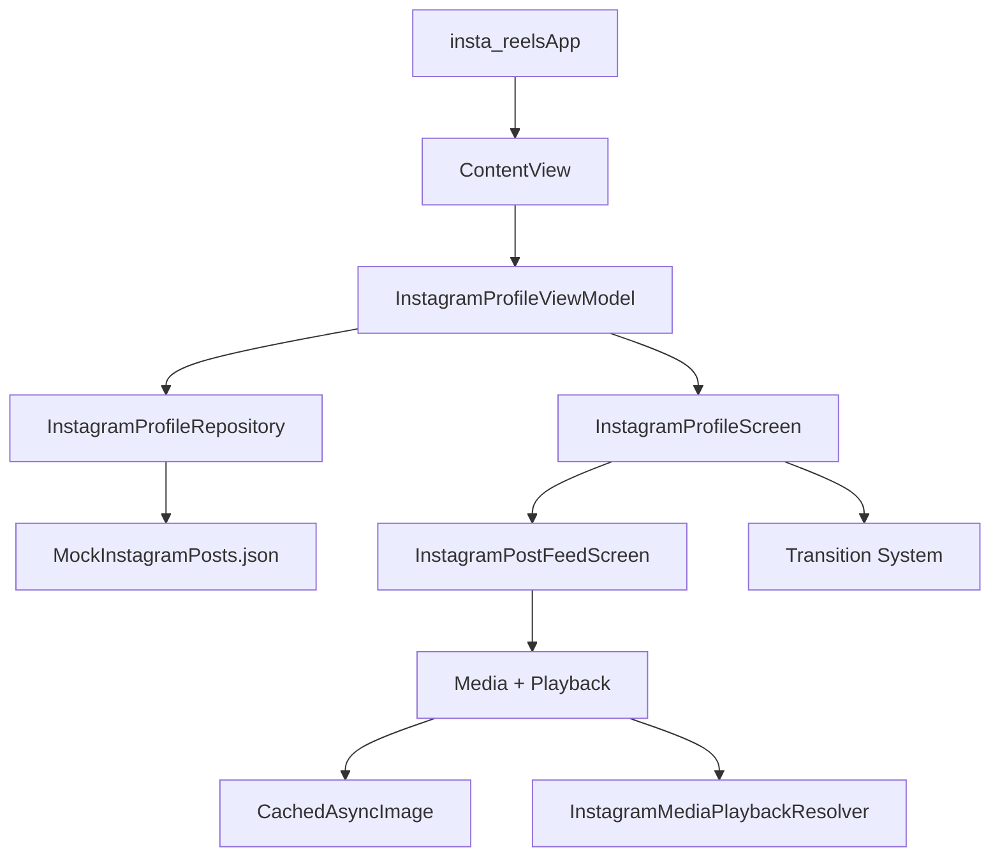

# Architecture

This file is the living architecture reference for `insta-reels`.

Use it to:
- understand how the app is put together
- decide where new code should live
- keep feature work aligned with the existing structure
- update future contributors on transition, media, and data-flow decisions

Update this file whenever any of these change:
- a new screen or major view model is added
- data starts coming from a new source
- transition behavior changes
- shared media/loading infrastructure changes
- folders gain a new responsibility

## Overview

`insta-reels` is a SwiftUI app that renders an Instagram-style profile screen and an immersive post feed using bundled mock data.

High-level flow:

## Project Map

### App shell
- `insta-reels/insta_reelsApp.swift`
  Starts the app and mounts `ContentView`.
- `insta-reels/ContentView.swift`
  Owns the root `InstagramProfileViewModel` and launch overlay animation.

### Presentation layer
- `insta-reels/Views/InstagramProfileScreen.swift`
  Main profile UI, profile grid, single-hierarchy feed overlay coordination, live open transition, snapshot-based close transition, and return-to-grid behavior.
- `insta-reels/Views/InstagramPostFeedScreen.swift`
  Always-mounted post overlay content, visible post tracking, visible media tracking, gesture-based close, inline media paging, and chrome fading around the live media transition.

### Shared UI/media helpers
- `insta-reels/Views/CachedAsyncImage.swift`
  Shared image loading and disk/memory caching wrapper used by profile and feed surfaces.
- `insta-reels/Data/InstagramMediaPlaybackResolver.swift`
  Resolves playable video URLs and provides mock fallbacks for unsupported media hosts.

### State + transformation layer
- `insta-reels/ViewModels/InstagramProfileViewModel.swift`
  Converts repository payloads into screen-ready models for the profile screen.

### Data layer
- `insta-reels/Data/InstagramProfileRepository.swift`
  Loads mock data, filters posts, builds related-user lists, and returns payloads for the view model.
- `insta-reels/MockInstagramDataset.swift`
  Core model definitions and JSON decoding for bundled mock content.
- `insta-reels/MockInstagramPosts.json`
  Bundled source of truth for posts, users, media, comments, and metrics.

## Layer Responsibilities

### 1. App and startup

`insta_reelsApp` should stay thin.

`ContentView` is responsible for:
- creating the root view model
- holding launch-overlay state
- deciding when the UI is ready to transition from launch to app content

Keep app-wide boot logic here unless it becomes reusable enough to justify its own coordinator or bootstrap layer.

### 2. View model layer

`InstagramProfileViewModel` is the adapter between raw repository data and UI-ready structures.

It is responsible for:
- loading the profile payload
- transforming posts into stats, highlights, grid items, and feed items
- exposing a simple `loading / loaded / failed` UI state

It should not:
- own animation state
- know about geometry, transitions, or SwiftUI view coordination
- fetch media directly

### 3. Data layer

`InstagramProfileRepository` is the boundary around data retrieval.

It is responsible for:
- reading bundled mock posts
- filtering authored vs all-post grids
- deriving related users
- returning a stable `InstagramProfilePayload`

If the project later moves to a network backend, this is the layer that should change first. The view model should continue talking to a repository protocol, not to networking code directly.

### 4. Screen/view layer

`InstagramProfileScreen` is the most stateful view in the app today.

It owns:
- profile screen composition
- grid layout
- grid item frame measurement
- feed presentation state
- single-hierarchy overlay positioning
- open and close transition coordination
- dismiss snapshot state
- return-to-grid polish animation

`InstagramPostFeedScreen` owns:
- feed layout and scrolling
- top bar and close gesture
- visible post detection
- visible media frame reporting
- media pager state per feed card
- inline video lifecycle
- chrome visibility separate from the moving media surface

## Runtime Data Flow

Normal profile load:

1. `ContentView` creates `InstagramProfileViewModel`.
2. `InstagramProfileScreen` calls `loadIfNeeded()`.
3. `InstagramProfileViewModel` requests a payload from `InstagramProfileRepository`.
4. The repository decodes bundled JSON via `MockInstagramDataset`.
5. The view model transforms the payload into `InstagramProfileScreenModel`.
6. `InstagramProfileScreen` renders the model.

Feed open flow:

1. User taps a grid item.
2. `InstagramProfileScreen` records the tapped grid cell frame and sets feed presentation state.
3. `InstagramPostFeedScreen` is already in the same root `ZStack`, so there is no navigation or screen push.
4. The live feed overlay itself animates from the tapped cell frame to the full-screen frame.
5. Feed chrome fades in only after the motion completes in a non-animated cleanup step.

Feed close flow:

1. `InstagramProfileScreen` freezes feed-driven transition updates.
2. The target grid cell frame is resolved.
3. Close captures the currently visible feed media into a bitmap snapshot.
4. The live feed overlay is hidden and the snapshot animates back to the grid cell.
5. State is reset only after the snapshot animation finishes.

## Transition Architecture

This project uses a hybrid transition strategy on purpose.

### Opening transition

Opening uses a live single-hierarchy overlay motion.

Current open behavior:
- never navigate away from the profile screen
- keep `InstagramPostFeedScreen` in the same root `ZStack` as the profile feed
- record the tapped grid cell frame in window coordinates
- animate the live overlay from the grid cell frame to the full-screen frame
- keep the media visible during motion while feed chrome fades in afterward
- finish cleanup in a non-animated transaction so there is no end-of-animation handoff flash

Important implementation detail:
- `InstagramProfileScreen` owns the overlay frame and presentation sequencing
- `InstagramPostFeedScreen` stays mounted and responds to `isPresented` / `presentationSequence` instead of mount-time navigation events

### Closing transition

Closing still prefers a snapshot overlay path because it is more stable than relying on two live views during teardown.

Reasons:
- the feed can mutate visible media while dismissing
- the destination grid cell can re-enter the hierarchy at the wrong moment
- live source/destination swaps are more prone to flicker at the last frame
- a single bitmap avoids the reveal race between the live overlay and the destination grid cell

Current close behavior:
- freeze feed-driven transition updates during dismiss
- capture the current visible feed media into a snapshot
- animate the snapshot to the grid target frame
- hide the live feed overlay while the snapshot is animating
- remove the snapshot and restore the real grid in one non-animated transaction

If future work touches dismiss behavior, preserve these invariants:
- never let the target post/media change mid-dismiss
- never reveal the destination too early
- clean up animation state in one atomic step
- prefer the snapshot path over a live-view teardown if the two approaches conflict

## Media Architecture

`CachedAsyncImage` is the shared image surface for the app.

It provides:
- async loading
- in-memory caching
- disk caching
- decoded-image reuse for repeated profile/feed surfaces

`InstagramMediaPlaybackResolver` isolates playback URL rules, especially for mock video handling.

If media support grows, extend these helpers before duplicating custom image/video loading in individual screens.

## Key State Ownership

### Root state
- `ContentView`
  launch overlay and root view-model lifetime

### Screen state
- `InstagramProfileScreen`
  transition sequencing, overlay frame state, grid hiding/reveal state, dismiss snapshot state, and grid return animation state

### Feed state
- `InstagramPostFeedScreen`
  visible post detection, feed scrolling, visible media frame reporting, presentation-driven repositioning, and chrome visibility
- `FeedMediaPager`
  selected media page per post
- `FeedVideoPlaybackController`
  inline video readiness, mute state, and playback loop behavior

## Conventions For Future Work

### Put code here when...

- Add profile-level UI or transition state:
  `insta-reels/Views/InstagramProfileScreen.swift`
- Add feed behavior or per-post feed rendering:
  `insta-reels/Views/InstagramPostFeedScreen.swift`
- Add screen-facing derived state:
  `insta-reels/ViewModels/InstagramProfileViewModel.swift`
- Add data fetching or payload shaping:
  `insta-reels/Data/`
- Add shared image/video utilities:
  `insta-reels/Views/CachedAsyncImage.swift` or `insta-reels/Data/`

### Avoid

- putting repository logic inside SwiftUI views
- putting geometry/animation state inside the view model
- duplicating image loading logic in multiple view files
- mixing mock-data decoding with view composition code

## Suggested Next Refactors

These are not required now, but they are the cleanest pressure-release points if the app grows:

1. Extract transition state from `InstagramProfileScreen` into a dedicated transition coordinator or view model.
2. Split reusable profile subviews into separate files once the profile screen becomes harder to scan.
3. Move feed card, media pager, and video playback pieces into dedicated files if feed complexity increases.
4. Add a `docs/` folder if architecture, animation, and product docs grow beyond a single file.

## Maintenance Checklist

When you change the project structure, update this file by checking:

- Is there a new top-level screen?
- Did any file take on a new responsibility?
- Did data start coming from a new source?
- Did the transition system change?
- Did media loading or playback behavior move?
- Does the project map still match the repo?

If the answer is yes to any of these, update `ARCHITECTURE.md` in the same PR or change set.
